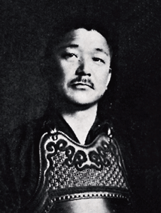

# Shigehachi (繁八)

> Compare two sets of images and generate difference images



[](https://semaphoreci.com/paazmaya/shigehachi)
[](https://ci.appveyor.com/project/paazmaya/shigehachi/branch/master)
[](https://codecov.io/gh/paazmaya/shigehachi)
[](https://github.com/igrigorik/ga-beacon)
[](https://www.versioneye.com/user/projects/54db51cec1bbbda0130002eb)
[](http://inch-ci.org/github/paazmaya/shigehachi)

This tool reads a folder, searching for images and then tries to find matching ones
from another folder. These pairs are compared and an image is created to a third folder,
which visualises the differences of the first two.

The name of the project is for honouring the legacy of Mr Sonobe Shigehachi (園部 繁八),
who was the 16th head master of
[Jikishinkageryu Naginatajutsu (直心影流薙刀術)](http://naginata.fi/en/koryu),
which is an ancient Japanese martial art, focusing the handling of a long pole like weapon
called naginata.

## Getting started

Make sure you have [GraphicMagick](http://www.graphicsmagick.org/) installed and available
in the `PATH`, before trying to use `shigehachi`. This can be tested by running for example
the following command which should provide plenty of information when successful:

```sh
gm version
```

Install the `sakugawa` command line utility globally with [npm](https://www.npmjs.com/).
Elevated privileges might be needed via `sudo`, depending on the platform. In most cases just:

```sh
npm install --global shigehachi
```

Please note that this tool requires the minimum [Node.js](https://nodejs.org/en/)
version to be `4.2.0`, which is the Long Term Support (LTS) version.

Run from the command line, for example getting the help output:

```sh
shigehachi -h
```

Compare two directories with the default comparison algorithm and store
differentiation images to a folder called `images-diff`:

```sh
shigehachi -P images-previous -C images-current -O images-diff
```

Along with the "compare" image, there will also be a "negate" and "composite" images,
which should help to determine which metric algorithm is the most suitable for the given
comparison.

The amount of supported metric algorithms, comparison styles and composition types depends
of the GraphicsMagick version. Available options are listed in [the source file](./index.js) and
in the [relevant GraphicsMagick documentation](http://www.graphicsmagick.org/compare.html).

## Comparison example

By running the following command on two screen captures of
[naginata.fi](http://naginata.fi/en/koryu) that were taken while adjusting paddings:

```sh
shigehachi --current-dir tests/fixtures/curr/website \
 --previous-dir tests/fixtures/prev/website \
 --output-dir tests/expected/website \
 --match '\.(png)$' \
 --metric rmse
```

...would result these three images, in the order of "difference", "negate", and "composite":

[](./tests/expected/website/naginata-koryu.png)
[](./tests/expected/website/naginata-koryu-negate.png)
[](./tests/expected/website/naginata-koryu-composite.png)

The [previous](./tests/fixtures/prev/website/naginata-koryu.png) and
[current](./tests/fixtures/curr/website/naginata-koryu.png) images are available at
the `tests/fixtures` directory.

Output after the command had executed looked like this:

```json
{
  "tests/fixtures/curr/website/naginata-koryu.png": {
    "metric": "PeakAbsoluteError",
    "normalised": {
      "red": "0.9725490196",
      "green": "0.9333333333",
      "blue": "0.9333333333",
      "total": "0.9725490196"
    }
  }
}
```

## Command line options

The output of `shigehachi --help` pretty much covers all the options:

```sh
shigehachi [options]

  -h, --help                                        Help and usage instructions
  -V, --version                                     Version number, with verbosity also application
                                                    name
  -v, --verbose                                     Verbose output, will print which file is
                                                    currently being processed
  -P, --previous-dir String                         Directory in which the previous images are
                                                    stored - default: previous
  -C, --current-dir String                          Directory in which the current images are
                                                    stored - default: current
  -O, --output-dir String                           Directory in which the resulting
                                                    differentiation images are stored - default:
                                                    diff-2015-11-16T11-16
  -c, --color String                                Color used in the output images, such as
                                                    \#b10dc9 or purple - default: pink
  -m, --metric One of: mae, mse, pae, psnr, rmse    Difference calculation metric - default: pae
  -s, --style One of: assign, threshold, tint, xor  Style in which the differentiation image is
                                                    created - default: tint
  -p, --compose One of: over, in, out, atop, xor, plus, minus, add, subtract, difference, divide,
                multiply, bumpmap, copy, copyred, copygreen, copyblue, copyopacity, copycyan,
                copymagenta, copyyellow, copyblack
      Composition type used for creating a composite image - default: difference
  -M, --match String                                Regular expression for matching and filtering
                                                    image files - default: \.png$
  -l, --long-diff-name                              Include used metric, style and composition
                                                    options in difference image file names
  -r, --recursive                                   Recursive search of images in the previous and
                                                    current directories

Version 4.0.0
```

Combining `--version` and `--verbose` (or using `-Vv`) the output will also contain the name
of the application in addition to the version number.

## Application programming interface

Best example of the usage inside another application is inside the script that is used
for the command line interface, `bin/shigehachi.js`.

Installation with [npm](https://www.npmjs.com/):

```sh
npm install --save shigehachi
```

First include this module in your script:

```js
const Jikishin = require('shigehachi');
```

Define the options, which follow the same convention as the command line options, with the
exception of being camelCased from the long versions. Below is an example of all configuration
options by using their default values:

```js
const options = {
  color: 'pink',
  compose: 'difference',
  currentDir: 'current',
  longDiffName: false,
  match: '\.png$',
  metric: 'pae',
  outputDir: 'diff-2016-09-01T11-16', // based on the current date and time
  previousDir: 'previous',
  recursive: false,
  style: 'tint',
  verbose: false,
  whenDone: null
};
```

Initialise an instance with the above `options` object and call `exec()` method
to generate the images:

```js
const kage = new Jikishin(options);
kage.exec();
```

In addition to the options used for command line, there is also a callback which gets
called when the execution has been done. It gets passed one argument, which is the
collection object of metrics, indexed by the current image file path.

```js
const options = {
  whenDone: function (metrics) {
    console.log(JSON.stringify(metrics, null, '  '));
  }
};

const kage = new Jikishin(options);
kage.exec();
```

The metrics output could look something similar to:

```json
{
  "tests/fixtures/curr/postcss.png": {
    "metric": "PeakAbsoluteError",
    "normalised": {
      "red": "0.1411764706",
      "green": "0.7882352941",
      "blue": "0.7960784314",
      "opacity": "1.0000000000",
      "total": "1.0000000000"
    }
  }
}
```

## File matching

Please note that the command line option and the module configuration expects the `match`
to be a string which is passed to `new RegExp()` constructor.

By default all PNG files are taken in use, with `/\.png$/`, but the reason for having
the option as a regular expression, is to have much more flexibility in which file names
are filtered. Please note that while escaping characters in a string, the backward slash
needs to be escaped as well.

The current implementation does not allow to set any flags for the regular expression,
but the functionality can be added with a suitable pull request.

[More about JavaScript regular expressions.](https://developer.mozilla.org/en/docs/Web/JavaScript/Guide/Regular_Expressions)

## Output image files and their naming

It is possible to alter the naming scheme of the images that are produced by the comparison,
negation and composition steps inside the single comparison of two image files.

By default the comparison image will have the same basename as the two which are being compared.
For example `prev/image.jpg` and `curr/image.jpg` will produce `diff/image.png`.
Please note that the generated images are always in [png](http://www.w3.org/TR/PNG/)
format, due to quality requirements.

The negated image, which is generated from the comparison image, will have `-negate` appended
to the basename, before the suffix. For example in the above case it would
be `diff/image-negate.png`.

The third image is a composition of the two images that are being compared. In many cases
this is visually the most useful image, depending of the colours and composition method used.
The basename is appended with `-composite`, thus in the example above `diff/image-composite.png`.

These filenames can be altered via `longDiffName` boolean option. By default it is set to `false`
and the filenames are created as explained above. In case it is set to `true`, the filenames
will also be appended with the used `metric`, `style`, or `color`, depending of the relevance
to the given method.

For example while following the above example and setting the `longDiffName` to `true`, the
generated three images would become with the default options:

* `diff/image-pae-tint.png`
* `diff/image-pae-tint-negate.png`
* `diff/image-pae-tint-composite-difference.png`

## Contributing

[Please refer to a GitHub blog post on how to create somewhat perfect pull request.](https://github.com/blog/1943-how-to-write-the-perfect-pull-request "How to write the perfect pull request")

Linting is done with [ESLint](http://eslint.org) and can be executed with `npm run lint`.
There should be no errors appearing after any JavaScript file changes.

Unit tests are written with [`tape`](https://github.com/substack/tape) and can be executed with `npm test`.
Code coverage is inspected with [`nyc`](https://github.com/istanbuljs/nyc) and
can be executed with `npm run coverage` after running `npm test`.
Please make sure it is over 90% at all times.

## Version history

* `v4.0.6` (2016-09-01)
    - Remove the quotes around filenames added in `v4.0.5` as they were trouble like :neckbeard: to :princess:
* `v4.0.5` (2016-09-01)
    - Color was no applied when supposed to due to additional quotes #10
    - Fixing documentation to match implementation
    - While programmatically used, the default color was not `pink`. Now it is, as documented
* `v4.0.4` (2016-08-08)
    - Move code coverage from `instanbul` to `nyc`
    - Test also in Windows, at [AppVeyor](https://ci.appveyor.com/project/paazmaya/shigehachi)
    - Lint lib folder contents too
* `v4.0.3` (2016-07-11)
    - There is always room for dependency updates
    - Functionality split in to different files
* `v4.0.2` (2016-03-22)
    - Plenty of dependency updates
* `v4.0.1` (2015-12-04)
    - Using ES2015 arrow functions to reduce the amount of lines in code
    - Code coverage results via codecov #7
* `v4.0.0` (2015-11-16)
    - Switch to `optionator` from `nomnom` #6
    - `differenceDir` changed to `outputDir`
    - Using `stderr` instead of `stdout` for error cases, `console.error()` versus `console.log()`
* `v3.0.0` (2015-10-29)
    - Require Long Term Supported Node.js version, namely minimum of `4.2.0`
    - Start to use ES2015 features and enable ESLint to validate against those
* `v2.3.0` (2015-04-27)
    - Output image file naming verbosity via `longDiffName` option
* `v2.2.0` (2015-04-14)
    - Enforce all resulting images as PNG, instead of accidentally just assuming so
    - Output examples
* `v2.1.0` (2015-04-14)
    - Clean up command creation since they all are subcommands of `gm`
    - Fixed the image file order for `gm composite` command, changed image first
    - New option `compose` for setting composition type,
      defaults to `'difference'` which was hard coded previously
* `v2.0.1` (2015-04-14)
    - ImageMagick was still used in two of the three commands
* `v2.0.0` (2015-04-08)
    - Ability to filter files with regular expression matching
    - Removed suffix option, in favour of matching with a regular expression
* `v1.1.0` (2015-04-07)
    - Added the ability to filter directories recursively
    - Make sure all target directories exist
* `v1.0.0` (2015-04-02)
    - Project initiated and script imported from `nanbudo.fi` test script collection
    - Dependency status via Versioneye #3
    - Unit tests with tape and code coverage with covert #4
    - Automated tests via Semaphore #2

## License

Copyright (c) [Juga Paazmaya](https://paazmaya.fi) <paazmaya@yahoo.com>

Licensed under [the MIT license](./LICENSE).

